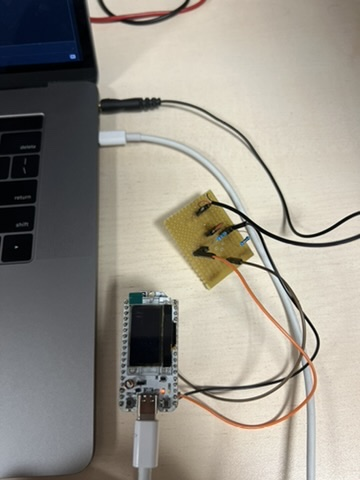
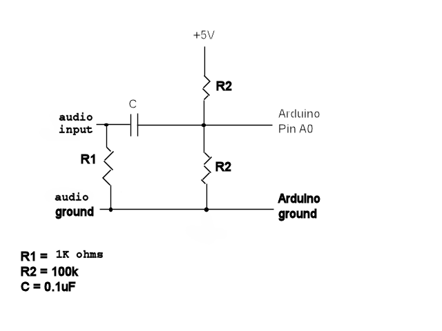
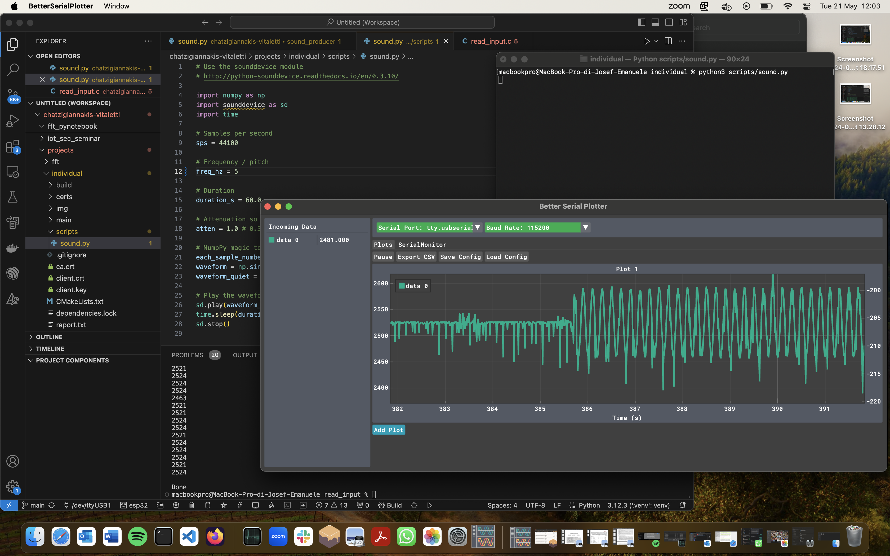
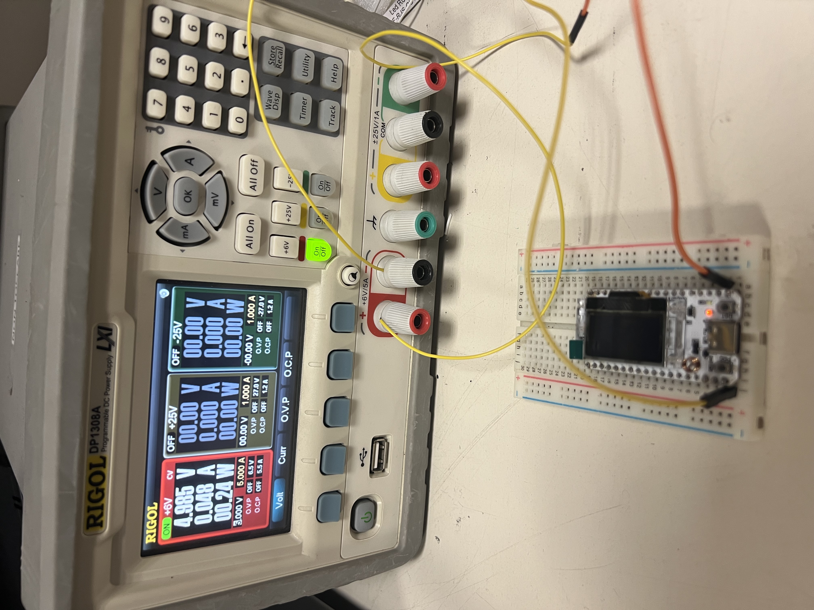
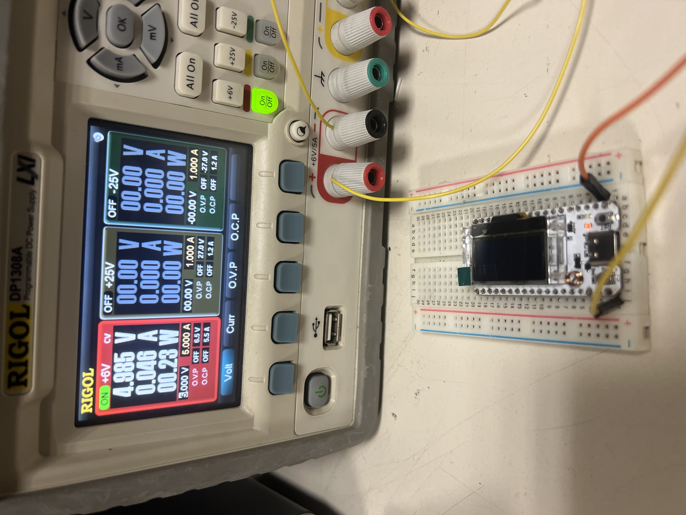

# IoT sensing and forwarding

This project has been developed for the [esp32s3](https://www.espressif.com/en/products/socs/esp32) device. 
The aim of this projects is being able to sense an external signal, perform calculations such as fft and 
aggregation, connecting to the cloud and uploading aggregated values for further analysis.

# Sampling the signal

## Setup

To sample the signal we have used a 3.5 mm audio jack as external sensor. We have reproduced a voltage 
divider circuit to center the signal at half the operating voltage of the esp32 board, as well as to 
filter out the continuous current outputted by the audio card of the pc. [Reference](https://forum.arduino.cc/t/how-to-read-data-from-audio-jack/458301/3)

## Reproducing a signal

With such setup we are able to sense audio signal produced by the pc. With the python script provided under 
`scripts/`, we're able to setup the characteristics of the audio signal, like frequency and amplitude.

To reproduce the experiment above, edit the `main/sample.c` file, uncommenting the printf. Download [BetterSerial Plotter](https://hackaday.io/project/181686-better-serial-plotter) 
to plot the values received from the serial connection pc-to-esp32. Start the python script to send the audio signal.

Alternatively, for testing purpouses, we've also implemented the reproduction of a sinusoidal signal inside the c code. The reproduced signal
can be defined as a sum of multiples sinusoids, with varying amplitudes and frequencies. With the FFT operation, we want to identify these
different frequencies and find the highest frequency composing the signal.

To reproduce a composed signal from the code, edit the `main/sample.h` file, setting the signal parameters. Also, uncomment
the lines providing the input to the buffer in `main/sample.c`.

# Performing FFT

To compute FFT esp-idf comes with a handy library, the [esp-dsp](https://docs.espressif.com/projects/esp-dsp/en/latest/esp32/esp-dsp-examples.html).
We used the example on the documentation as a template, to compute the fft of the signal. From there we started computing magnitudes of the 
different frequencies tested, applying z-score evaluation, to find outlier values, hance identifying all of the different frequencies 
composing the audio signal. From those, we are only interested in the highest frequency. Because of the [Nyquist-Shannon sampling theorem]
(https://en.wikipedia.org/wiki/Nyquist–Shannon_sampling_theorem) we need to sample a signal at at least twice the frequency of the signal
to be able to correctly reconstruct it. By setting the sampling frequency at twice the maximum frequency composing the signal, we are sure to 
be able to safely reconstruct it.

You can find the implementation of the fft calculation and frequency extrapolation in `main/fft.c`.

# Adapting the sampling frequency

The maximum sampling frequency for the ADC module of the esp32 is about 2 MHz, shutting down the WiFi module. Otherwise the documentation
segguests to use sampling frequencies of up to 1 kHz. [Reference](https://docs.espressif.com/projects/esp-faq/en/latest/software-framework/peripherals/adc.html#:~:text=The%20ESP32%20ADC%20has%2018,per%20second%20with%20Wi%2DFi.). There's a catch though. In this project 
we nhave implemented the sensing by sleeping during sensing intervals. The sleep function of FreeRTOS, the operating system running on the 
esp32 board, has a minimum input value of 10 ms. This means that by implementing the sampling frequency in this way, we will 
have an upper bound of 100 Hz. [Reference](https://esp32.com/viewtopic.php?t=32384)
A partial solution could be to increase the tick rate of the freeRTOS operating system, from the default 100 ticks per second to 1000
ticke per second, hence having a minimum sleep time of 1 ms. Increasing the tick rate though adds overhead to the scheduling process,
making the process spend more time on scheduling. A good debate on this issue can be read [here](https://stackoverflow.com/questions/27503765/what-are-the-symptoms-effects-of-too-high-a-tick-rate-in-a-rtos).

For the sake of this project we're not going to mess with the operating systems' tick rate. Taking this into consideration, 
we can assume the maximum sampling frequency to be 100 Hz, maximum correctly sampled frequency of 49 Hz, and the buffer size 
to be at least 128. With 100 samples we're able to sample 1 second of input signal, correctly capturing frequencies greater than 1 Hz.
For the FFT to work properly we need a number of samples power of 2, since the FFT works with square roots. Hence 128 is the minimum 
acceptable buffer size.

As per the Nayquist-Shannon theorem, once found the maximum frequency of the input signal, we set the adapted sampling frequency
at twice the found frequency + 1.

You can find the calculation of the adapted frequency in `main/fft.c`.

# Aggregation

For the purpouse of this project we used a mean function as the aggregation function. Having defined the aggregation window in 
`main/aggregation.h`, for example 5 seconds, we take 5 seconds of samples from the sampled buffer, apply the aggregation function, 
and obtain the aggregated value.

Aggregation function is in `main/aggregate.c`

# Connecting to the cloud

To connect to the cloud the devices needs internet connectivity. We used a WiFi access point to provide internet connectivity. Then, 
implemented MQTT connectivity to make the esp32 board communicate with an external MQTT broker. We installed [Mosquitto](https://mosquitto.org)
as local MQTT broker, used [esp-mqtt](https://docs.espressif.com/projects/esp-idf/en/stable/esp32/api-reference/protocols/mqtt.html) 
library to control connection from the device to the broker.

The MQTT implementation is in `main/mqtt.c`.

# System performances

## Energy consumption

We have estimated the energy consumption by powering the esp32 board with 5 Volts. Luckily, the power supply in our laboratory
both provided the voltage and read the current drawn. Otherwise we would have provided the voltage, attached in serial a multimeter
to measure the amperage of the current flowing, and multiplied the two values to get the wattage.

Sampling in at maximum sampling frequency the device draws 0.048 amperes of current, consuming 0.24 Watts of power.

After adapting the sampling frequency to the input signal, the sampling operation draws 0.046 amperes of current, consuming 0.23 
Watts. Not a great difference. The adapted sampling frequency in this experiment was about 5 Hz.

The energy saving from sampling at maximum frequency to sampling at adapted frequency is of about 5%.

## Data volume

## Network latency

To calculate network latency we measured round-trip time from the device and the MQTT broker. We queried the system time when sending 
the aggregated value, queried again when receiving confirmation from the broker. The difference between the two values gives us the 
time round-trip time, the half of rtt gives an estimation on network latency.

Measured network latency is of about 5 milliseconds.

# Evaluating performances with different input signals

# Technical details
buffer size.
max sampling frequency.

# Walkthrough to setup and run the project

# Further improvements

